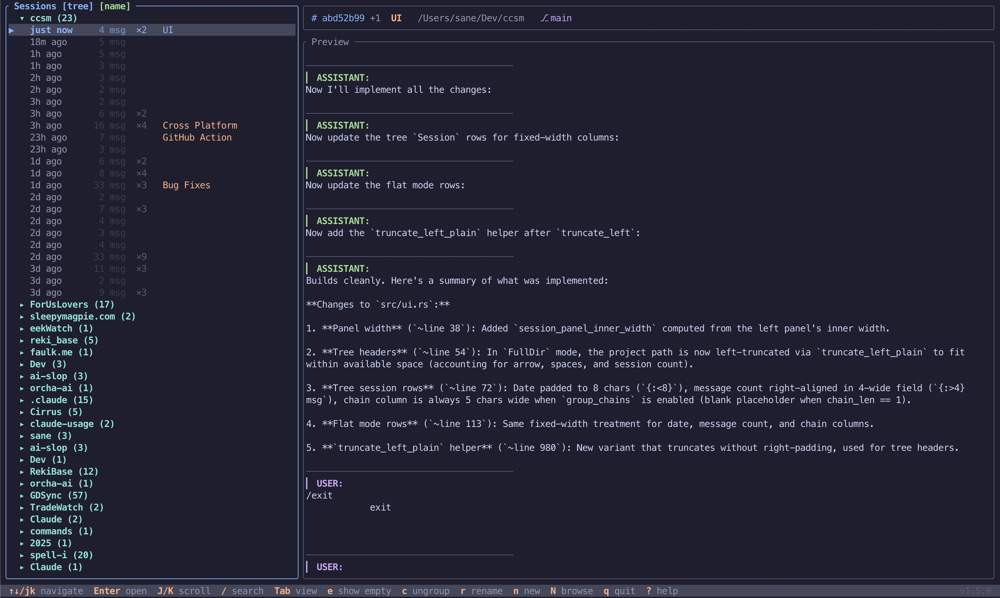
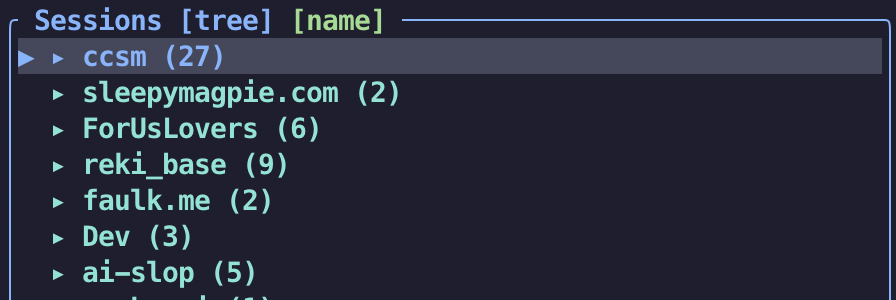
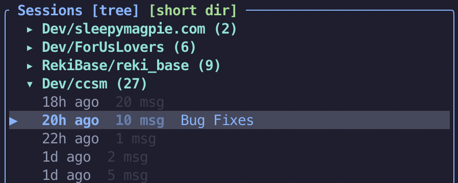
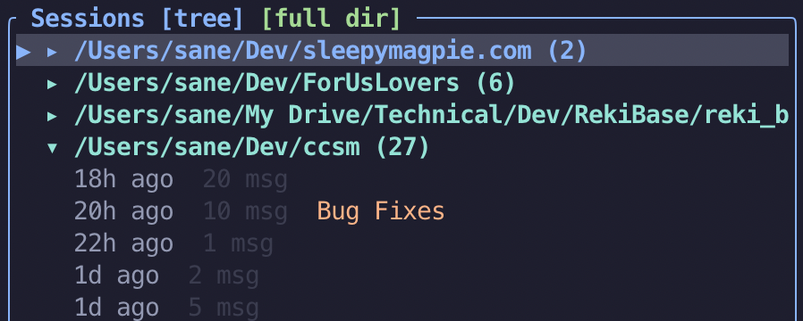
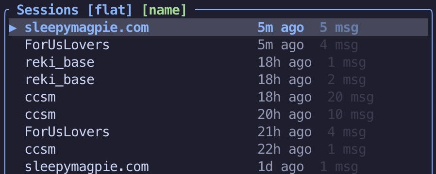
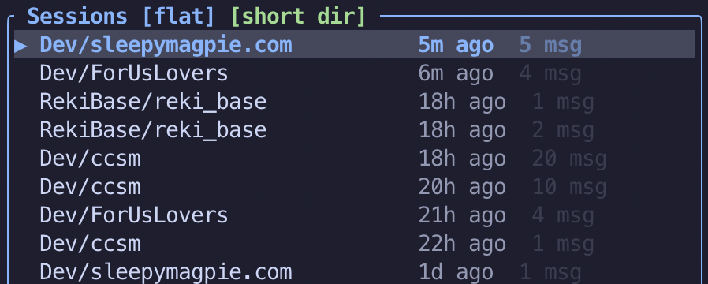
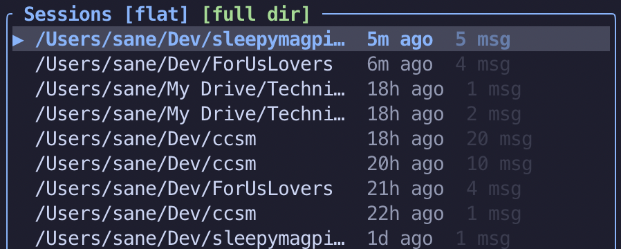
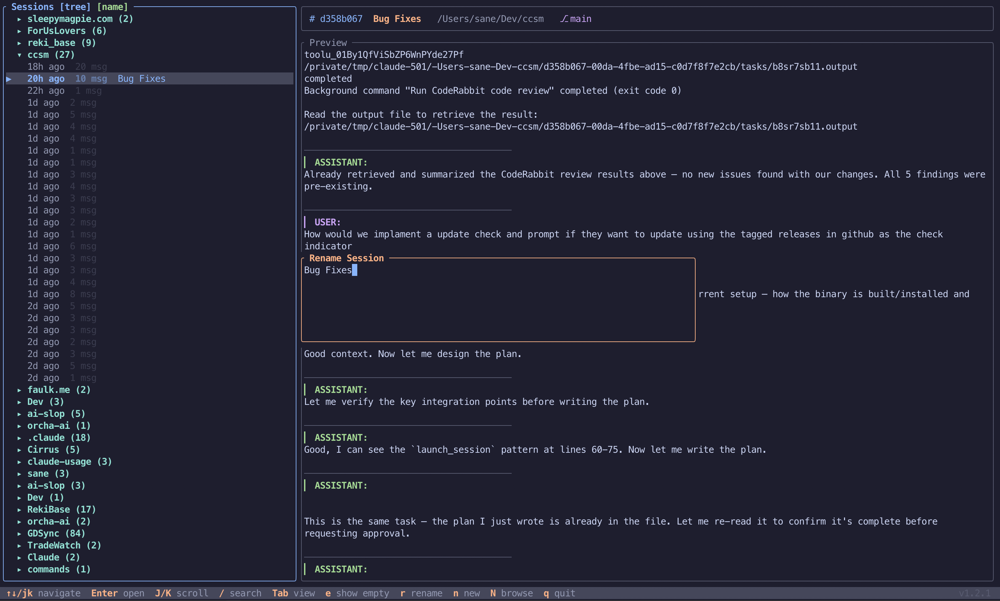
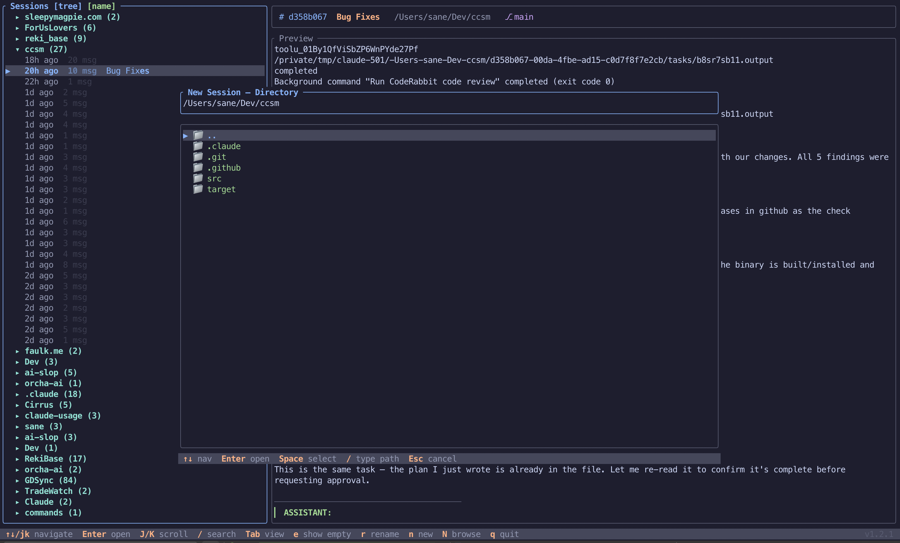

# ccsm — Claude Code Session Manager

A terminal UI for browsing your Claude Code session history, previewing conversations, and resuming or starting sessions in their original working directory.

## Screenshots

### Tree View with Session Preview
Sessions grouped by project with an expanded group showing individual sessions. The right pane displays a scrollable conversation preview with the session's working directory and git branch in the info bar.



### Display Modes

Cycle through display modes with `Tab` to change how projects are labeled in the session list.

**Tree view — project:**



**Tree view — short directory path:**



**Tree view — full directory path:**



### Flat View

All sessions in a single chronological list with project name, relative timestamp, and message count.

**Flat view — project name:**



**Flat view — short directory path:**



**Flat view — full directory path:**



### Rename Session
Press `r` to rename a session with a custom title that appears alongside the timestamp and message count.



### Directory Browser
Press `N` to open a full directory browser overlay for starting a new Claude session in any directory.



## Features

- **Tree view** (default) — sessions grouped by project, collapsed on startup, expand/collapse with arrow keys
- **Flat view** — all sessions in a single sorted list with project name, date, and message count
- **Display modes** — cycle through Name, Short Dir, and Full Dir labels for project groups in tree view
- Shows a scrollable preview of conversation messages (last 20 turns)
- **Session info bar** — displays working directory and git branch for the selected session; shows the project directory even when a header row is selected with no active session
- Resume any session directly — opens `claude --resume <id>` in the original project directory
- **New session** — launch a new Claude session in the selected project's directory (`n`) or browse to any directory (`N`)
- **Directory browser** — full overlay for navigating the filesystem, with path input and directory listing
- Search and filter sessions by project name or path
- Toggle visibility of empty sessions (no data file) with `e`
- Lazy-loads and caches session previews for fast navigation
- **Auto-update** — checks GitHub Releases in the background on startup (every 24h), shows a centered prompt with current vs new version, and self-updates the binary on confirm
- **Session names** — custom titles loaded in the background for fast startup
- **Persistent config** — view mode, display mode, hide-empty preference, and update check timestamp saved to `~/.config/ccsm/config.json`
- Optional path argument to scope sessions to a specific directory
- Version label displayed in the bottom-right of the help bar
- Catppuccin Mocha-inspired color theme

## Requirements

- **macOS** (ARM64, x86_64), **Linux** (x86_64, ARM64), or **Windows** (x86_64)
- [Claude Code CLI](https://docs.anthropic.com/en/docs/claude-code) installed and on your `PATH`
- Existing session history in `~/.claude/`

## Install

### Quick Install (pre-built binary)

**macOS / Linux:**

```sh
curl -fsSL https://raw.githubusercontent.com/faulker/ccsm/main/remote-install.sh | bash
```

This downloads the latest release binary from GitHub and installs it to `~/.local/bin/ccsm`. Make sure `~/.local/bin` is in your `PATH`.

**Windows (PowerShell):**

```powershell
irm https://raw.githubusercontent.com/faulker/ccsm/main/remote-install.ps1 | iex
```

This downloads the latest release and installs `ccsm.exe` to `%LOCALAPPDATA%\ccsm`, adding it to your user `PATH`.

### Build from Source

```sh
./install.sh
```

This builds a release binary and symlinks it to `~/.local/bin/ccsm`. Requires Rust 1.75+.

## Build

```sh
cargo build --release
```

The binary will be at `target/release/ccsm`.

## Run

```sh
cargo run --release
# or
./target/release/ccsm
```

Optionally pass a path to show only sessions from that directory:

```sh
./target/release/ccsm ~/projects/my-app
```

Use `--flat` to start in flat view instead of the default grouped tree view:

```sh
./target/release/ccsm --flat
./target/release/ccsm --flat ~/projects/my-app
```

## Key Bindings

| Key | Action |
|---|---|
| `j` / `↓` | Next session |
| `k` / `↑` | Previous session |
| `l` / `→` | Expand group (tree view) |
| `h` / `←` | Collapse group (tree view) |
| `Enter` | Resume session / toggle group |
| `Tab` / `Shift + Tab` | Cycle: tree [name] → tree [short dir] → tree [full dir] → flat → tree [name] |
| `Shift + J` | Scroll preview down |
| `Shift + K` | Scroll preview up |
| `/` | Activate search/filter mode |
| `c` | Toggle session grouping (group/ungroup related sessions) |
| `e` | Toggle show/hide empty sessions |
| `n` | New Claude session in selected project's directory |
| `Shift + N` | Open directory browser to start a new session anywhere |
| `r` | Rename selected session |
| `q` / `Esc` / `Ctrl+C` | Quit |

### Update Prompt

When an update is available, a centered dialog appears:

| Key | Action |
|---|---|
| `y` | Download and install the update |
| `n` / `Esc` | Dismiss until next run |

### Filter Mode

When filter mode is active (triggered by `/`):

| Key | Action |
|---|---|
| Type characters | Filter sessions by project name or path (case-insensitive) |
| `↓` / `↑` | Navigate results (stays in filter mode) |
| `Enter` | Exit filter mode (keeps filter active) |
| `Backspace` | Delete last character |
| `Esc` | Clear filter text and exit filter mode |

### Directory Browser

When the directory browser is open (triggered by `N`):

| Key | Action |
|---|---|
| `↑` / `↓` | Navigate directory listing |
| `Enter` | Enter selected directory |
| `Space` | Select current directory and launch new session |
| `/` | Type a path directly |
| `Esc` | Cancel and close browser |

## Configuration

Settings are persisted to `~/.config/ccsm/config.json` and automatically saved when changed:

```json
{
  "tree_view": true,
  "display_mode": "name",
  "hide_empty": true,
  "last_update_check": 1710200000
}
```

| Field | Values | Description |
|---|---|---|
| `tree_view` | `true` / `false` | Start in tree or flat view |
| `display_mode` | `"name"`, `"short_dir"`, `"full_dir"` | How project groups are labeled in tree view |
| `hide_empty` | `true` / `false` | Whether to hide sessions with no data file |
| `last_update_check` | Unix timestamp | When the last update check was performed (auto-managed) |

## How It Works

1. Reads `~/.claude/history.jsonl` to build a list of sessions with project paths and timestamps
2. On selection, loads the session file from `~/.claude/projects/{path}/{sessionId}.jsonl`
3. Extracts session metadata (working directory, git branch) and displays it in an info bar
4. Filters to user/assistant messages and displays the last 20 turns as a preview
5. On startup, spawns a background thread to check GitHub Releases for newer versions (respects 24h cooldown)
6. Session custom titles are loaded in the background to avoid blocking startup
7. On Enter, suspends the TUI and runs `claude --resume <id>` in the session's original directory
8. On `n`/`N`, launches a new `claude` session in the chosen directory
9. If the user accepts an update, the TUI suspends, downloads the new binary, replaces the current executable, and resumes
10. After Claude exits, the TUI resumes

## Dependencies

- `ratatui` — TUI rendering framework
- `crossterm` — terminal backend and event handling
- `serde` / `serde_json` — JSON parsing
- `dirs` — home directory and config directory detection
- `chrono` — relative timestamp formatting
- `anyhow` — error handling
- `ureq` — lightweight HTTP client for GitHub Releases API
- `flate2` — gzip decompression for release archives
- `tar` — tar archive extraction

## Tests

```sh
cargo test
```
