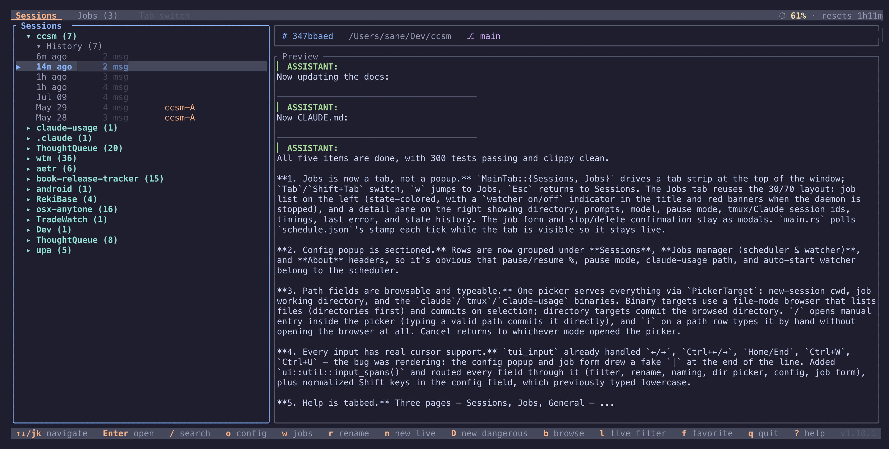
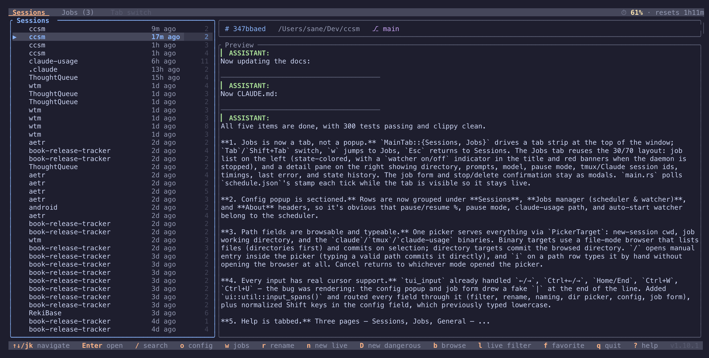
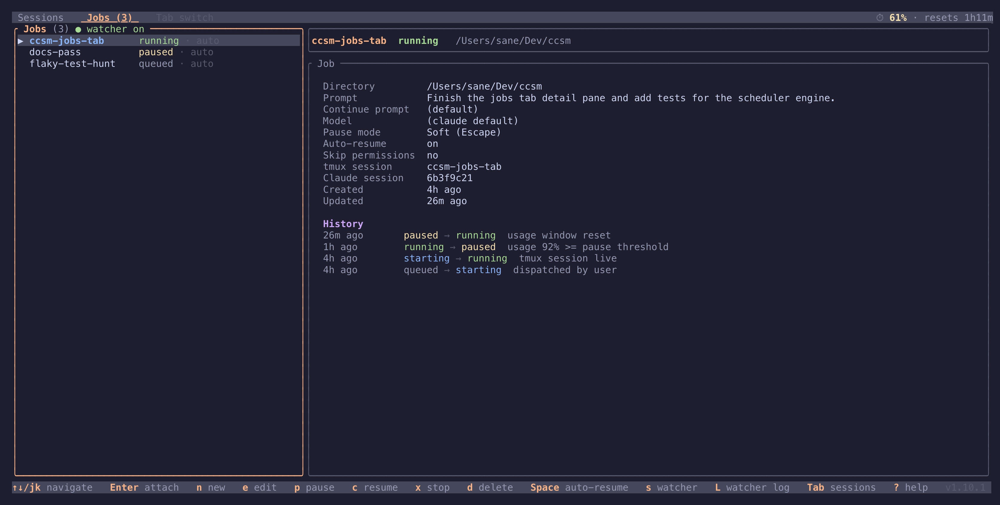
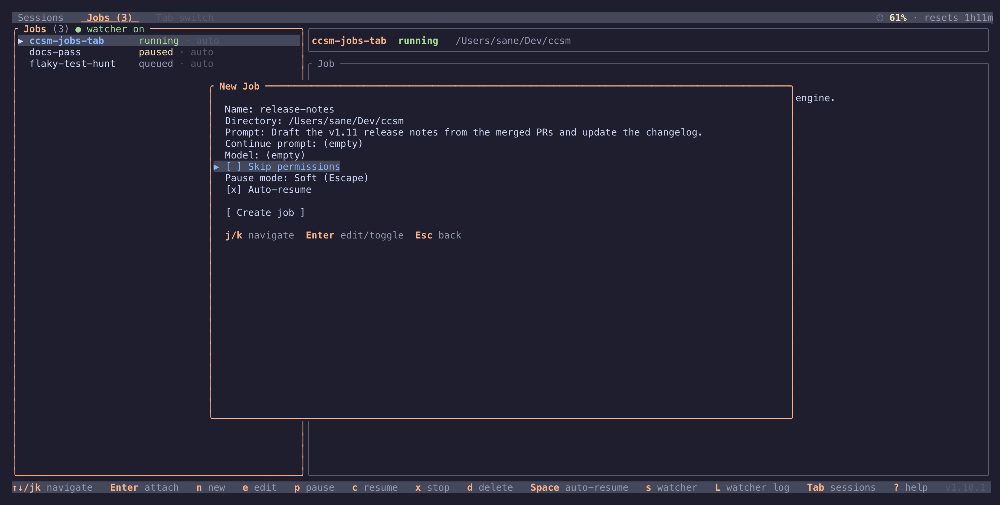
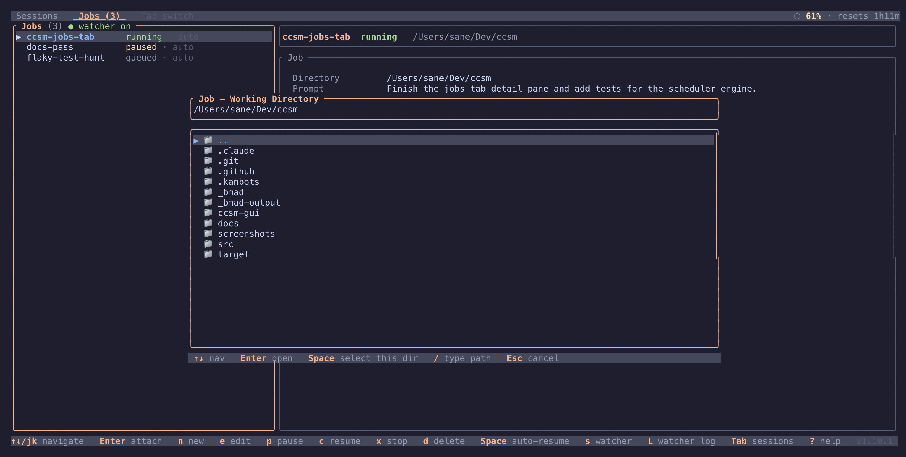
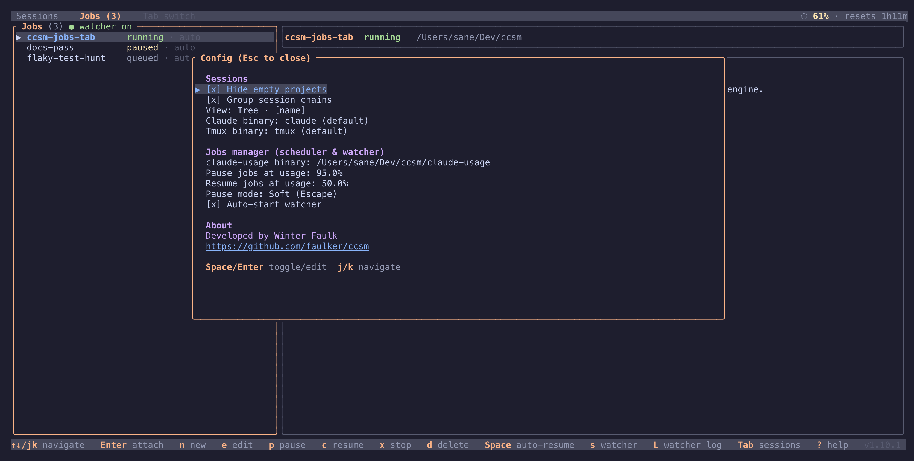
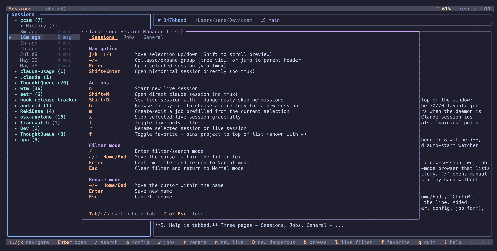

# ccsm — Claude Code Session Manager

A terminal UI that puts all your Claude Code sessions in one place. Browse past conversations, resume where you left off, and spin up new sessions — all without leaving the terminal. If you juggle multiple projects or frequently context-switch between Claude sessions, ccsm keeps everything organized and a keystroke away so you can stay in flow.

## Screenshots

### Tree view with session preview
Sessions grouped by project with an expanded group showing individual sessions. The right pane displays a scrollable conversation preview, with the session's working directory and git branch in the info bar. The tab strip along the top carries the current usage percentage and the time until your window resets, so it stays visible on every tab.



### Flat view
The same sessions as one flat, newest-first list instead of project groups. Start ccsm with `--flat`, or switch views from the config popup.



### Jobs tab
The scheduler's view: jobs on the left colored by state, the selected job's full detail on the right. The history at the bottom is where the usage-aware behavior shows up, pausing when usage crossed the threshold and resuming once the window reset.



### Job form
Press `n` on the Jobs tab to dispatch a new session: a name, a working directory, the prompt to start with, and the pause/resume behavior the watcher should apply.



### Directory browser
Every path the app needs can be browsed instead of typed, whether it is a new session's directory, a job's working directory, or the `claude` / `tmux` / `claude-usage` binaries. Press `/` inside the picker to type a path by hand.



### Config popup
Press `o` for settings, grouped so it is clear which ones drive the scheduler.



### Tabbed help
Press `?` for the keybinding reference. It opens on the page matching the tab you are on and switches pages with `Tab`.



## Features

- **Tabbed main window** — `Tab` switches between the Sessions browser and the Jobs manager; both use the same list + detail layout
- **Tree & flat views** — browse sessions grouped by project or as a flat list; cycle display modes from the config popup (`o`, then `Tab`)
- **Conversation preview** — scrollable preview of the last 20 turns with working directory and git branch in the info bar
- **Resume anywhere** — resume a session in tmux (`Enter`) or directly in the foreground (`Shift+Enter`)
- **Live sessions** — start, attach, detach, rename, and stop tmux-backed Claude sessions; running sessions surface at the top with activity indicators (● active, ● idle, ▶ waiting) and real-time pane preview
- **Quick launch** — `n` opens one popup for every launch mode (`Tab` cycles plain, skip-permissions, git worktree, and foreground session, or `ccsm --new` / `ccsm --spawn` to skip the TUI entirely
- **Usage-aware scheduling** — dispatch sessions with a prompt, pause them automatically before your 5-hour budget runs out, and continue them when it resets, all without being at the keyboard (Jobs tab, `Tab`)
- **Jobs know when they are finished** — every dispatched prompt asks the agent to sign off with `CCSM_JOB_COMPLETE`, which the watcher reads from the session transcript; a job that reports it (or sits idle past a configurable window) is marked done, its session stopped, and it is never re-dispatched
- **Usage always in view** — the tab strip shows your current usage percentage, the time until the window resets, and a red `⏱ off` if the watcher daemon has died, on every tab
- **Directory browser** — browse for any path the app needs: a new session's directory (`b`), a job's working directory, or the `claude`/`tmux`/`claude-usage` binaries in the config popup — and type it by hand instead if you prefer
- **Full cursor editing** — every text field supports `←`/`→`, `Ctrl+←`/`→` by word, `Home`/`End`, `Ctrl+W`, and `Ctrl+U`
- **Duplicate detection** — catches duplicate session names with options to open, rename, or cancel
- **Search & filter** — filter by project name or path; toggle live-only mode with `l`
- **Favorites** — pin projects to the top of the list with `f`
- **Mouse scroll** — scroll the preview pane with the mouse wheel; auto-scrolls to bottom for live sessions
- **Config popup** — press `o` for settings grouped into **Sessions**, **Jobs manager**, and **About** sections, so it is clear which settings drive the scheduler
- **Auto-update** — background update checks with one-key install, SHA256 checksum verification, and automatic restart
- **Tabbed help** — press `?` for a keybinding reference split into Sessions / Jobs / General pages; it opens on the page matching the tab you are on
- **Persistent config** — preferences saved to `~/.config/ccsm/config.json`
- Catppuccin Mocha color theme

## Requirements

- **macOS** (ARM64, x86_64), **Linux** (x86_64, ARM64), or **Windows** (x86_64)
- [Claude Code CLI](https://docs.anthropic.com/en/docs/claude-code) installed and on your `PATH`
- Existing session history in `~/.claude/`
- `tmux` installed for live session support (optional — history browsing works without it)
  - **macOS:** `brew install tmux` (requires [Homebrew](https://brew.sh))
  - **Linux:** `sudo apt install tmux` / `sudo dnf install tmux` / your distro's package manager

## Install

### Quick Install (pre-built binary)

**macOS / Linux:**

```sh
curl -fsSL https://raw.githubusercontent.com/faulker/ccsm/main/remote-install.sh | bash
```

This downloads the latest release binary from GitHub and installs it to `~/.local/bin/ccsm`. Make sure `~/.local/bin` is in your `PATH`.

**Windows (PowerShell):**

```powershell
irm https://raw.githubusercontent.com/faulker/ccsm/main/remote-install.ps1 | iex
```

This downloads the latest release and installs `ccsm.exe` to `%LOCALAPPDATA%\ccsm`, adding it to your user `PATH`.

### Build from Source

```sh
./install.sh
```

This builds a release binary and symlinks it to `~/.local/bin/ccsm`. Requires Rust 1.75+.

## Build

```sh
cargo build --release
```

The binary will be at `target/release/ccsm`.

## Run

```sh
ccsm
```

Optionally pass a path to show only sessions from that directory:

```sh
ccsm ~/projects/my-app
```

Use `--flat` to start in flat view instead of the default grouped tree view:

```sh
ccsm --flat
ccsm --flat ~/projects/my-app
```

Use `--live` to start directly in live-only filter mode (implies `--flat`), showing only running tmux sessions:

```sh
ccsm --live
```

Use `--new` to immediately start a new live Claude session in the current directory and attach to it, without opening the TUI. After Claude exits, ccsm relaunches automatically:

```sh
ccsm --new
```

Use `--spawn` from within a live tmux session to create a new session and switch to it without leaving tmux:

```sh
ccsm --spawn
```

Use `--watch` to run the usage-aware scheduler daemon in the foreground, or `--watch-status` to print its health and job summary. Neither opens the TUI. The daemon normally starts itself when you create a job, so these are mainly for debugging:

```sh
ccsm --watch
ccsm --watch-status
```

## Quick Start

### Resume a past session

1. Run `ccsm` to open the session browser
2. Navigate with `j`/`k` (or arrow keys) — sessions are grouped by project
3. Press `→` or `Enter` on a project header to expand it and see individual sessions
4. The right pane shows a scrollable preview of the selected conversation
5. Press `Enter` to resume the session in tmux, or `Shift+Enter` to resume directly in your terminal

### Start a new live session

**From the TUI:**

1. Select any project in the list
2. Press `n` to start a new tmux-backed session in that project's directory
3. Type a name (or accept the auto-generated one) and press `Enter`

**From the command line:**

```sh
ccsm --new    # skip the TUI — start a session in the current directory immediately
```

### Switch between live sessions and detach

Once you're attached to a live session inside tmux:

- `Ctrl+n` — switch to the next live session
- `Ctrl+p` — switch to the previous live session
- `Ctrl+l` — spawn a new session and switch to it
- `Ctrl+\` — detach and return to the ccsm session browser

Back in the TUI, live sessions appear at the top of the list with activity indicators: **●** green (active), **●** amber (idle), **▶** red (waiting for input). Press `Enter` to re-attach to any of them.

## Key Bindings

| Key | Action |
|---|---|
| `j` / `↓` | Next session |
| `k` / `↑` | Previous session |
| `→` | Expand group (tree view) |
| `←` | Collapse group or jump to parent header (tree view) |
| `Enter` | Resume session in tmux / attach to live session / toggle group |
| `Shift+Enter` | Resume historical session directly in the foreground (no tmux) |
| `Tab` / `Shift+Tab` | Switch between the Sessions and Jobs tabs |
| `Shift+J` / `Mouse wheel ↓` | Scroll preview down |
| `Shift+K` / `Mouse wheel ↑` | Scroll preview up (disables auto-scroll for live sessions) |
| `/` | Activate search/filter mode |
| `o` | Open config popup (Sessions / Jobs manager / About sections) |
| `Space` | Toggle favorite — pins project to top of list (shown with ★) |
| `n` | New session popup — `Tab` cycles plain / danger / worktree / direct |
| `v` | Cycle the view mode (tree / flat / grouped) |
| `l` | Toggle live-only filter (show only running sessions) |
| `r` | Rename selected session or live session |
| `x` | Stop selected live session (asks for confirmation) |
| `b` | Browse for a directory to start a new session in |
| `m` | Manage the selected session as a job (adopt live or historical) |
| `?` | Open help overlay |
| `q` / `Ctrl+C` | Quit |
| `Esc` | Back out of a popup or clear the filter — never quits |

In the config popup, `Tab` / `Shift+Tab` still cycles the session view mode
(tree [name] → tree [short dir] → tree [full dir] → flat).

### The new-session popup

`n` opens one popup for every way of starting a session. `Tab` cycles the mode
and the border colour follows it:

| Mode | What it launches |
|---|---|
| `plain` | A normal live session in tmux |
| `danger` | Adds `--dangerously-skip-permissions` |
| `worktree` | Its own git worktree (`claude --worktree`); dimmed outside a git repo |
| `direct` | A foreground `claude` with no tmux session (the name is unused) |

Press `Enter` to launch; leaving the name empty uses the suggested one.

### Small terminals

The status bar ranks its shortcuts and shows as many as fit, dropping the least
important first. `? help` and `q quit` are never dropped, and a trailing `…`
means some hints were hidden — press `?` for the full list. The help overlay
scrolls with `j`/`k` and `PgUp`/`PgDn`.

### Update Prompt

When an update is available, a centered dialog appears:

| Key | Action |
|---|---|
| `y` | Download, install, and restart |
| `n` / `Esc` | Dismiss until next run |

### Filter Mode

When filter mode is active (triggered by `/`):

| Key | Action |
|---|---|
| Type characters | Filter sessions by project name or path (case-insensitive) |
| `↓` / `↑` | Navigate results (stays in filter mode) |
| `Enter` | Exit filter mode (keeps filter active) |
| `←` / `→`, `Home` / `End` | Move the cursor within the filter text |
| `Backspace` / `Delete` | Delete before/after the cursor |
| `Ctrl+W` / `Ctrl+U` | Delete the previous word / clear the line |
| `Esc` | Clear filter text and exit filter mode |

### Session Naming

When naming a new live session (after selecting a directory):

| Key | Action |
|---|---|
| Type characters | Enter session name (placeholder shown if left blank) |
| `Enter` | Confirm name and launch session |
| `Esc` | Cancel |

### Live Session tmux Keybindings

While attached to a live session in tmux:

| Key | Action |
|---|---|
| `Ctrl+\` | Detach and return to ccsm |
| `Ctrl+n` | Switch to next live session |
| `Ctrl+p` | Switch to previous live session |
| `Ctrl+l` | Spawn a new live session and switch to it |

## Live Sessions

Live sessions are tmux-backed Claude Code sessions managed through a dedicated tmux server (`ccsm` socket). They appear at the top of the session list with color-coded activity indicators:

- **● Green** — active (Claude is working)
- **● Amber** — idle (waiting at the prompt)
- **▶ Red** — waiting (Claude is asking for user input/approval)

- **Start**: press `n`, then `Tab` to pick the launch mode (`plain` for a named live tmux session in the current project dir, `direct` for claude in the foreground with no tmux)
- **Start in a worktree**: press `n` and `Tab` to the `worktree` mode, which launches with `claude --worktree <session name>` so the session gets its own git worktree and branch instead of sharing your checkout. The mode is dimmed and unselectable outside a git repository, so ccsm refuses up front rather than letting claude fail inside a tmux session you would have to attach to first.
- **Attach**: press `Enter` on any live session to attach
- **Detach**: press `Ctrl+\` inside a live session to return to ccsm
- **Navigate**: use `Ctrl+n` / `Ctrl+p` to cycle between live sessions without detaching
- **Stop**: press `x` to gracefully kill the selected live session
- **Rename**: press `r` on a live session to rename the tmux window
- **Filter**: press `l` to hide history and show only running sessions

The tmux server uses a custom config at `~/.config/ccsm/tmux.conf` with a status bar showing the available keybindings. Requires `tmux` to be installed.

## Scheduled Jobs (usage-aware sessions)

A Pro/Max plan gives you a fixed budget per rolling 5-hour window. If a long task
exhausts it, you normally have to buy extra credit or wait for the reset, and waiting
means being at the keyboard when it happens. Scheduled jobs close that gap: ccsm starts
a session with a prompt, watches your account usage, interrupts the session before the
budget runs out, and continues it automatically once the window resets.

The Jobs manager is the second tab of the main window: press `Tab` to reach it.
The left pane lists jobs with their state, the right pane shows the selected job's
configuration, timings, last error, and state history. `m` on the Sessions tab adopts
whatever is selected there (a running live session or a past one) as a managed job.

Current usage sits in the tab strip on both tabs (`⏱ 61% · resets 1h11m`), colored green,
amber, or red as you approach the pause threshold. A `?` after the percentage means the
sample is stale, and the whole chip reads `⏱ off` in red when jobs exist but the watcher
is not running, since a silently dead watcher is the one failure that strands every job.

| Key | Action (on the Jobs tab) |
|---|---|
| `j` / `k` | Navigate |
| `Enter` | Attach to the job's tmux session |
| `n` / `e` | New job / edit selected |
| `p` / `c` | Pause now / continue now |
| `x` / `d` | Hard stop / delete (both confirm first) |
| `f` | Mark done, ending the job for good (confirms first) |
| `Space` | Toggle auto-resume |
| `s` | Start or stop the watcher daemon |
| `L` | Attach to the watcher's live log |
| `Tab` / `Esc` | Back to the Sessions tab |

The job form explains whichever field is selected in a block below the form, so the
scheduler's less obvious options (pause modes, auto-resume, the continue prompt) do not
need looking up. Two fields behave specially:

- **Directory** opens the directory browser (`Enter` or `b`), or `i` to type the path by hand.
- **Model** is a picker, not a text field: `Enter`, `Space`, or `←`/`→` cycle it, and `i`
  types a model id by hand. The list is built at startup rather than shipped with ccsm, so
  it follows Claude Code as models come and go. It always offers the tier aliases (`opus`,
  `sonnet`, `haiku`, `fable`), which resolve to the current model in each tier, and adds
  every concrete model id Claude Code itself knows about from `~/.claude.json` (the extra
  entries in its own model picker, plus anything that has actually billed tokens).

**Continue prompt** is what the watcher pastes to wake a paused session. Leaving it blank
on a job inherits the global default (`Continue where you left off.`), which the form and
detail pane both show in full rather than hiding behind "(default)". Change the global
default under **Jobs manager → Continue prompt** in the config popup (`o`); clearing it
restores the built-in text rather than storing an empty string.

### How a job finishes

A dispatched session has no natural end. Claude finishes the work, prints its summary,
and sits at an idle prompt looking exactly like a session that has merely paused, so
without a completion signal the watcher would keep waking it and relaunching it against
work that is already done. Two things stop that.

**The completion marker.** Every session the watcher launches carries a short
instruction in its system prompt (`--append-system-prompt`): when the task is completely
finished, make the last line of the final message exactly `CCSM_JOB_COMPLETE`. Every
continuation prompt repeats it, so a session ccsm adopted rather than launched learns the
protocol too. The instruction goes in the system prompt rather than being appended to the
job's prompt because Claude Code hands everything after a slash command to that command
as its arguments: a job whose prompt is `/goal @PLAN.md` would have swallowed the whole
protocol paragraph into the goal instead of hearing it. The watcher looks for
that line in the session's own transcript under `~/.claude/projects/`, not in the tmux
pane, because the instruction itself is echoed into the pane the moment it is pasted —
scraping the pane would match ccsm's own words and finish every job on dispatch. Only
`assistant` messages count, only whole lines match, and the marker written into a file
through a tool call is ignored, so an agent cannot end its job by talking about the
marker.

Once a job reports completion it moves to `done`: its tmux session is stopped, and
nothing dispatches, resumes, or relaunches it again. That holds no matter what state it
was in — a job that finishes and then exits on its own is caught in `stopped` before the
relaunch timer fires.

**The idle fallback.** An agent can forget the instruction, and an adopted session was
never told it in the first place. So a job whose pane has looked idle for an unbroken
stretch (default 15 minutes) is also marked done, with the reason recorded in its
history so it is never confused with a self-reported completion. A pane sitting on a
permission prompt reads as *waiting*, not idle, and is never swept up by this. Change
the window under **Jobs manager → Idle completion** in the config popup (`o`), or set it
to `0` to turn the fallback off and rely on the marker alone.

Press `f` on the Jobs tab to mark a job done by hand, which stops its session the same
way a self-reported completion does.

### How pausing works

Pausing sends a single `Escape` to the session's tmux pane. That interrupts the current
turn while leaving the process and the full conversation context alive, so resuming is
just a matter of pasting a continuation prompt. Usage only accrues from API calls, so a
session idling at its prompt costs nothing, which is why this is the default. `Hard`
pause mode is available if you would rather kill the tmux session and relaunch later
with `claude --resume`.

Two thresholds keep it from oscillating: **Pause at %** (default 95) and **Resume at %**
(default 50). A session paused because it hit 95% will not resume until usage falls to
50% or the window demonstrably resets.

### The watcher daemon

The watcher is what makes this work while you are away, so it runs as a separate headless
process rather than inside the TUI:

```sh
ccsm --watch          # run the daemon in the foreground (usually not needed)
ccsm --watch-status   # print daemon health and a summary of every job
```

It normally starts on its own the first time you create a job (`Auto-start watcher` in
the config popup), living in its own `ccsm-watch` tmux session on the same `ccsm` socket.
It survives closing the TUI and is hidden from the session list. `tmux -L ccsm attach -t
ccsm-watch` gives you a live log tail, and the same log is written to
`~/Library/Application Support/ccsm/watch.log`.

The daemon is the only writer of job state. The TUI never edits `schedule.json` directly;
it drops command files into a queue that the daemon drains, which is what keeps two
processes from corrupting each other's writes. If the daemon is not running, the Jobs
tab says so in red (both in its title and a banner) and reports how many commands are
waiting, so queued work is never silently lost.

### Usage data

Usage comes from the `claude-usage` binary, invoked as `claude-usage --format json`. Set
its path in the config popup if it is not on your `PATH`. Without it the rest of ccsm
works normally; only job creation is disabled.

ccsm is deliberately conservative about stale readings: a stale sample can still trigger
a pause (erring toward stopping), but never a resume.

## Configuration

Settings are persisted to `~/.config/ccsm/config.json` and automatically saved when changed:

```json
{
  "tree_view": true,
  "display_mode": "name",
  "hide_empty": true,
  "group_chains": true,
  "live_filter": false,
  "favorites": [],
  "last_update_check": 1710200000,
  "usage_pause_percent": 95.0,
  "usage_resume_percent": 50.0,
  "pause_mode": "soft",
  "watch_autostart": true
}
```

| Field | Values | Description |
|---|---|---|
| `tree_view` | `true` / `false` | Start in tree or flat view |
| `display_mode` | `"name"`, `"short_dir"`, `"full_dir"` | How project groups are labeled in tree view |
| `hide_empty` | `true` / `false` | Whether to hide sessions with no data file or exit-only sessions |
| `group_chains` | `true` / `false` | Whether to group chained (parent → child) sessions |
| `live_filter` | `true` / `false` | Whether to show only running live sessions |
| `favorites` | Array of paths | Project directories pinned to the top of the list |
| `last_update_check` | Unix timestamp | When the last update check was performed (auto-managed) |
| `claude_path` / `tmux_path` / `usage_path` | Path or unset | Override binary locations; unset means look on `PATH` |

Scheduler settings, all editable under **Jobs manager** in the config popup (`o`):

| Field | Default | Description |
|---|---|---|
| `usage_pause_percent` | `95.0` | Pause managed sessions once usage reaches this percentage |
| `usage_resume_percent` | `50.0` | Resume only once usage falls to or below this percentage |
| `pause_mode` | `"soft"` | `soft` sends Escape and keeps context; `hard` kills the session and later relaunches with `--resume` |
| `watch_autostart` | `true` | Start the watcher daemon automatically when a job is created |
| `watch_seven_day` | `true` | Also pause on the 7-day window, not just the 5-hour one |
| `usage_poll_seconds` | `60` | How often to sample usage while a job is active |
| `usage_max_age_seconds` | `900` | A usage sample older than this counts as stale |
| `usage_source` | `"auto"` | Passed to `claude-usage --source` (`auto`, `local`, or `api`) |
| `defer_while_attached` | `true` | Skip automated keystrokes while you have the session attached |
| `continue_prompt` | `"Continue where you left off."` | Default text pasted to wake a paused job, when the job has no override |
| `continue_prompt` | `"Continue where you left off."` | Text pasted into a paused session to resume it |
| `max_restart_attempts` | `5` | Give up on a job after this many consecutive failures |

## How It Works

1. Reads `~/.claude/history.jsonl` to build a list of sessions with project paths and timestamps; exit-only sessions (where the user immediately typed `/exit`) are treated as empty
2. On selection, loads the session file from `~/.claude/projects/{path}/{sessionId}.jsonl`
3. Extracts session metadata (working directory, git branch) and displays it in an info bar
4. Filters to user/assistant messages and displays the last 20 turns as a preview
5. On startup, spawns a background thread to check GitHub Releases for newer versions (respects 24h cooldown)
6. Session custom titles are loaded in the background to avoid blocking startup
7. On `Enter` (history session), wraps the resume in a new tmux live session and attaches to it; on `Shift+Enter`, runs `claude --resume <id>` directly in the foreground without tmux; on return, sessions are reloaded
8. On `Enter` (live session), attaches to the tmux session and suspends the TUI; detach with `Ctrl+\` to return
9. On `n`/`N`, prompts for a session name then starts a new detached tmux session running `claude` in the chosen directory and attaches to it; uses a dedicated tmux server (`-L ccsm`) with a custom status bar
10. With `--new`, skips the TUI, creates a live tmux session in the current directory, attaches immediately, and re-execs ccsm when Claude exits
11. If the user accepts an update, the TUI suspends, downloads the new binary, verifies the SHA256 checksum against the release's `checksums-sha256.txt`, replaces the current executable, and automatically restarts
12. After Claude exits, the TUI resumes and reloads the session list

## Dependencies

- `ratatui` — TUI rendering framework
- `crossterm` — terminal backend and event handling
- `serde` / `serde_json` — JSON parsing
- `dirs` — home directory and config directory detection
- `chrono` — relative timestamp formatting
- `anyhow` — error handling
- `ureq` — lightweight HTTP client for GitHub Releases API
- `flate2` — gzip decompression for release archives
- `tar` / `zip` — archive extraction for release downloads
- `tempfile` — temporary directories for safe binary replacement
- `unicode-width` — correct text width calculation for multi-byte characters
- `regex` — pattern matching for live session activity detection
- `sha2` — SHA256 checksum verification for update downloads

## Tests

```sh
cargo test
```
